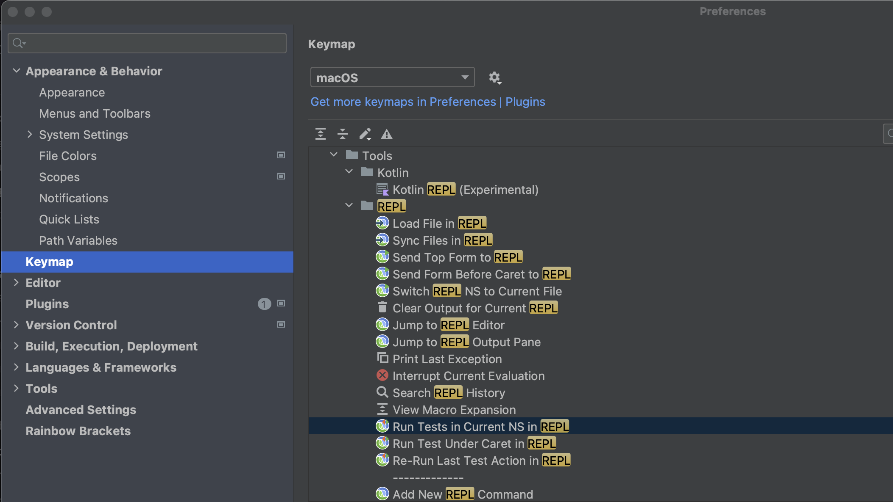

# Clojure

Projeto de estudo em acompanhamento aos cursos da Formação Clojure da plataforma de ensino Alura.

## [Curso 1](curso1_estoque) - Clojure: programação funcional

Para primeira execução deve-se clicar no arquivo "project.clj" e selecionar "Run 'REPL for estoque'",
onde REPL significa _read-eval-print loop_.

O **Namespace** é especificado pela macro `ns` na parte superior do arquivo e deve corresponder ao caminho do local do arquivo.
É um contexto  e um container para vars, lower-case e usa hífen(-) por padrão para separar palavras.
O comando utilizado para utilizar um namespace específico é `(use 'estoque.aula2)`.

### Characters Clojure

 - Vírgula `,` é tratado como espaço em branco.
 - `_` usado como argumento de função indica que este argumento não será utilizado.
 - [Listas](https://clojure.org/reference/data_structures#Lists) são coleções heterogêneas sequenciais, implementadas como uma lista encadeada.
   ```clojure 
        (1 "two" 3.0)  ; uma lista de três valores
   ```
 - [Vetores](https://clojure.org/reference/data_structures#Vectors) são coleções heterogêneas, sequenciais, indexadas. As funções aplicadas sobre eles retornan uma nova instância com valores alterados, mantendo a imutabilidade do vetor inicial.
   ```clojure 
        ["a" 13.7 :foo]              ; vetor de três valores
        (get ["a" 13.7 :foo] 1)      ; recuperação do valor no índice 1 de um vetor
        (count [1 2 3])              ; contagem dos valores, 3
        user=> (conj [1 2 3] 4 5 6)  ; adicionando elementos ao vetor
        [1 2 3 4 5 6]
   ```
 - [Mapas](https://clojure.org/reference/data_structures#Maps) são coleções heterogêneas espcificadas com chaves e valores.
   ```clojure 
        user=> {:a 1 :b 2}         ; mapa com duas combinações de chave/valor
        user=> (keys {:a 1 :b 2})  ; obtenção das chaves de um mapa
        (:a :b)
   ```
 - [Keyword](https://clojure.org/guides/weird_characters#_keyword)
      `:` é o indicador para uma palavra-chave, frequentemente usadas como chaves em mapas, possuem comportamento melhor do que strings.
       Também pode ser utilizada como função para procurar a si em um mapa.
   ```clojure 
        user=> (type :test)       ; verificação do tipo Keyword
        clojure.lang.Keyword
        user=> (keyword "test")   ; criação de uma keyword a partir de uma string
        :test
        
        user=> (def my-map {:one 1 :two 2})
        #'user/my-map
        user=> (:one my-map)      ; obtém o valor da key :one invocando como uma função
        1
   ```

### Funções

    **Funções** são "coisas", é a maneira informal de dizer que, em Clojure, funções são tratadas como algo muito importante, tão importantes quanto dados.
Isto é, você pode trabalhar com símbolos que referenciam funções. Funções são "first class citizens".
Inclusive você pode passá-las como argumento para outras funções, ou recebê-las como retorno de funções.
Funções que recebem ou retornam funções são chamadas de "higher order functions".
   
   - Uma [função anônima](https://clojure.org/guides/weird_characters#_anonymous_function) pode ser iniciada por `fn`ou `#(`. Utiliza-se `%` para fazer uma função lambda:
   ```clojure
      ; função anônima que recebe um argumento e print
      (fn [line] (println line))
      ; função anônima de mesmo comportamento, porém mais curta
      #(println %)
   ```
   - Função [`map`](https://clojure.org/reference/other_functions)
   ```clojure
      user=> (map (fn [x] (+ 2 x)) [1 2 3])
      (3 4 5)
      user=> (map #(+ 2 %) [1 2 3])
      (3 4 5)
   ```
   - [Reduce](https://clojuredocs.org/clojure.core/reduce) `(reduce f coll) (reduce f val coll)` <br>
     `f` deve ser uma função de 2 argumentos. Se `val` não for fornecido,
     retorna o resultado da aplicação de `f` aos 2 primeiros itens em `coll`, então aplicando `f` a esse resultado e ao 3º item, etc. <br>
     Se `coll` não contiver itens, `f` também não deve aceitar argumentos, e reduce retorna o
     resultado de chamar `f` sem argumentos. <br>
     Se `coll` tiver apenas 1 item, ele é retornado e `f` não é chamado. <br>
     Se `val` for fornecido, retorna o resultado da aplicação de `f` para `val` e o primeiro item em `coll`, então
     aplicando `f` a esse resultado e ao 2º item, etc. <br>
     Se `coll` não contiver itens, retorna `val e `f` não é chamado.
    ```clojure
      (reduce + [1 2 3 4 5])  ;;=> 15
      (reduce + [])           ;;=> 0
      (reduce + [1])          ;;=> 1
      (reduce + [1 2])        ;;=> 3
      (reduce + 1 [])         ;;=> 1
      (reduce + 1 [2 3])      ;;=> 6
   ```
   - [Comp](https://clojuredocs.org/clojure.core/comp)
   Pega um conjunto de funções e retorna um fn que é a composição desses fns.
   O fn retornado recebe um número variável de argumentos, aplica o fns mais à direita aos argumentos,
   nas próximas fn (da direita para a esquerda) para o resultado, etc.
   ```clojure
      (def negative-quotient (comp - /))   ;; #'user/negative-quotient
      (negative-quotient 8 3)              ;;=> -8/3
   
      ((comp str +) 8 8 8)                 ;;=> "24"
   ```
   Na documentação é possível acessar a descrição de diversas funções, [https://clojuredocs.org/clojure.core](https://clojuredocs.org/clojure.core).

### [**Thread**](https://clojure.org/guides/threading_macros)
   - Por convenção, as funções principais que operam em sequências esperam a sequência como seu último argumento. Da mesma forma, pipelines contendo **map**, **filter**, **remove**, **reduce**, **into**, etc geralmente chamam a macro ´->>` "thread last".
   ```clojure
   (defn calculate* []
      (->> (range 10)
      (filter odd? ,,,)
      (map #(* % %) ,,,)
      (reduce + ,,,)))
   ```
   - As funções principais que operam em estruturas de dados, por outro lado, esperam o valor em que trabalham como seu primeiro argumento. Estes incluem **assoc**, **update**, **dissoce getsuas** -invariantes. Os pipelines que transformam mapas usando essas funções geralmente exigem a macro `->` "thread first".
   ```clojure
       (defn transform* [person]
          (-> person
             (assoc ,,, :hair-color :gray)
             (update ,,, :age inc)))
   ```

## [Curso 2](curso2_loja) - Clojure: coleções no dia a dia

### First

A macro [`first`](https://clojuredocs.org/clojure.core/first) retorna o primeiro item de uma coloeção.
```clojure
    (first '(:alpha :bravo :charlie))   ;;=> :alpha
    (first nil)                         ;;=> nil
    (first [])                          ;;=> nil
```

### Rest

A macro [`rest`](https://clojuredocs.org/clojure.core/rest) retorna uma sequência de itens após o primeiro, possivelmente vazia. Chama seq em seu argumento.
```clojure
    (rest [1 2 3 4 5])            ;;=> (2 3 4 5)
    (rest '())                    ;;=> ()
    (rest nil)                    ;;=> ()
```

### Next

A macro [`next`](https://clojuredocs.org/clojure.core/next) retorna uma sequência de itens após o primeiro. Retorna nil se não houver mais itens.
```clojure
    (next '(:alpha :bravo :charlie))     ;; (:bravo :charlie)
    (next [])                            ;; => nil
```

### Seq

A macro [`seq`](https://clojuredocs.org/clojure.core/seq) retorna uma sequência na coleção. Se a coleção for vazio, retorna zero.
```clojure
    (seq '(1))  ;;=> (1)
    (seq [1 2]) ;;=> (1 2)
    (seq "abc") ;;=> (\a \b \c)

    ;; Corner cases
    (seq nil)   ;;=> nil
    (seq '())   ;;=> nil
    (seq [])    ;;=> nil
    (seq "")    ;;=> nil
```

### Recur

A macro [`recur`](https://clojuredocs.org/clojure.core/recur) avalia as expressões em ordem, então, em paralelo, 
religa o retorno do ponto de recursão para os valores de entrada da expressão. 
Indica para o clojure que estamos fazendo uma recursão e só pode aparecer como retorno da função (cauda).
```clojure
    ; Exemplo para cáluclo de fatorial: n! = n . (n – 1). (n – 2). (n – 3) ... 2,1
    (def factorial
      (fn [n]
        (loop [contador n               ; contador inicializado com valor 'n'
               acumulador 1]            ; acumulador inicializado com valor 1
          (println "contador:" contador "| acumulador:" acumulador "| n:" n)
          (if (zero? contador)
            acumulador
            (recur (dec contador) (* acumulador contador))))))
    ; no loop contador tomará o valor (dec contador) // dec retorna um número a menos
    ; e o acumulador tomará o valor da multiplicação (* acumulador contador)
    
    (println (factorial 4))
```

Na recursão deve ser explicitado o critério de parada da repetição.

### Multi-aridade

A aridade é simplesmente o número de argumentos que uma função pode receber.
Uma maneira de definir [funções multiaridade](https://theburningmonk.com/2013/09/clojure-multi-arity-and-variadic-functions/)
é usar a macro defn, por exemplo:
```clojure
    (defn greet
      ([] (greet "you"))                ;; implementação com aridade 0
      ([name] (print "Hello" name)))    ;; implementação com aridade 1

    (greet)                             ;; => Hello you
    (greet "World")                     ;; => Hello World
```
### Loop

No [`loop`](https://clojuredocs.org/clojure.core/loop) a recursão é realizada em trecho de código dentro da função e não de toda a função em si.
Este caso geralmente ocorre com trecho de código antes do loop.
Nesse caso provavelmente há um controle de fluxo que deveria ter sido isolado em outro trecho de código.

### For
Clojure possui também um [`for`](https://clojuredocs.org/clojure.core/for) que recebe uma sequência de expressões de inicialização e o corpo a ser executado.
Ele funciona de forma similar ao loop, iterando pelos elementos da sequência, mas permitindo já loopar e definir novos símbolos com :when, :while e :let.
Como comentamos no caso do loop, tradicionalmente você verá outras formas de executar um mesmo bloco ao invés de loop e for.

```clojure
    (println "For imprimirá os resultados:")
    (println " 1 * 1 = 1 | 1 * 2 = 2 | 1 * 3 = 3")
    (println " 2 * 1 = 2 | 2 * 2 = 4 | 2 * 3 = 6")
    (println " 3 * 1 = 3 | 3 * 2 = 6 | 3 * 3 = 9")

    (def digits [1 2 3])

  (println (for [x1 digits
                 x2 digits]
             (* x1 x2)))
```

### Importação de classe
Importação de classe `loja.db` em `loja.aula3`, utilizando `:as` para abreviação.
```clojure
    (ns loja.aula3
      (:require [loja.db :as l.db]))
````

### Nth

Retorna o valor no índice. Obtém retornos nulos se o índice estiver fora limites, [`nth`](https://clojuredocs.org/clojure.core/nth) lança uma exceção, a menos que não encontrado seja fornecido.
`NTH`(enésimo) também funciona para strings, arrays Java, regex Matchers e Lists e, em tempo O(n), para sequências.
```clojure
  ; (nth coll index)(nth coll index not-found)
  ; Note that nth uses zero-based indexing, so that
  ;   (first my-seq) <=> (nth my-seq 0)
  (def my-seq ["a" "b" "c" "d"])
  (nth my-seq 0)               ; => "a"
  (nth [] 0)                   ; => IndexOutOfBoundsException ...
  (nth [] 0 "nothing found")   ; => "nothing found"
```

### Take
Retorna uma sequência lenta dos primeiros n itens em coll, ou todos os itens se há menos de n.
Retorna um [transdutor](https://clojure.org/reference/transducers) com estado quando nenhuma coleta é fornecida.

```clojure
    ; (take n)(take n coll)
    (take 3 '(1 2 3 4 5 6))     ;;=> (1 2 3)
    (take 3 [1 2 3 4 5 6])      ;;=> (1 2 3)
    ;; returns all items if there are fewer than n
    (take 3 [1 2])              ;;=> (1 2)
    (take 1 [])                 ;;=> ()
    (take 1 nil)                ;;=> ()
```

### Some
Retorna o primeiro valor `true` de uma função (pred x) para qualquer x em col, senão retorna `nil`.
Um idioma comum do [`some`](https://clojuredocs.org/clojure.core/some) é usar um conjunto como pred.
por exemplo isso retornará :fred se :fred estiver na sequência, caso contrário nil: (algum #{:fred} col)

```clojure
    ;; 2 é par, então `some` para, 3 e 4 nunca serão testados
    (some even? '(1 2 3 4))      ;;=> true
    ;; they are all odd, so not true, i.e. nil
    (some even? '(1 3 5 7))      ;;=> nil
```

### Lazy e Eager

Existem consequências para cada tipo de função lazy,eager ou uma mescla dos dois.
Se o que será processado é infinito, não poderemos utilizar o processo eager, afinal não haverá memória o suficiente.
No caso de funções com efeito colateral, não é interessante mesclarmos lazy e eager, afinal isso demandaria um controle fino que pode ser trabalhoso.
Para grupos grandes e finitos, é interessante utilizarmos o processo lazy.
Precisamos sempre pensar se faz sentido otimizar o programa por essa via, e muitas vezes não será, pois nem sempre trabalhamos com vetores e listas de um milhão de elementos, por exemplo.

## [Curso 3](curso3_hospital) - Clojure: mutabilidade com átomos e refs

### [Peek](https://clojuredocs.org/clojure.core/peek)

Para uma lista ou fila, captura o primeiro elemento, o mesmo que o `first`. <br>
Para um vetor captura o último elemento, o mesmo que `last`, mas muito mais eficiente.
Se a coleção estiver vazia, retorna `nil`.

```clojure
      user=> (peek '(1 2 3 4)) ;;=> 1
      user=> (peek [1 2 3 4]) ;;=> 4
      user=> (peek []) ;;=> nil
```

### [Pop](https://clojuredocs.org/clojure.core/pop)

Para uma lista ou fila remove o primeiro item. <br>
Para um vetor remove o último item.
Se a coleção está vazia, lança uma exceção. Nota - não é o mesmo como próximo/último.
```clojure
      user=> (pop '(1 2 3 4)) ;;=> (2 3 4)
      user=> (pop [1 2 3 4]) ;;=> [1 2 3]
      user=> (pop []) ;;=> nil
      (pop ())        ;;IllegalStateException Can't pop empty list
```

### [Conj](https://clojuredocs.org/clojure.core/conj)

Retorna uma nova coleção com o xs 'adicionado'.
A adição pode acontecer em diferentes 'lugares' dependendo do tipo concreto.
```clojure
    (conj [1 2 3] 4) ;;=> [1 2 3 4] adiciona ao final do vetor
    (conj '(1 2 3) 4) ;;=> (4 1 2 3) adiciona ao início da lista
```

### [Ex-info](https://clojuredocs.org/clojure.core/ex-info)

Cria uma instância de ExceptionInfo, uma subclasse RuntimeException que carrega um mapa de dados adicionais.
```clojure
    (throw
      (ex-info "This exception is not caught" {:useless :data}))
```

### [Atom](https://clojuredocs.org/clojure.core/atom)

Cria e retorna um Atom com um valor inicial de x e zero ou mais opções (em qualquer ordem).
Se o mapa de metadados for fornecido, ele se tornará os metadados no átomo.

### [Swap!](https://clojuredocs.org/clojure.core/swap!)

Troca atomicamente o valor do átomo para ser: `(apply f current-value-of-atom args)`.
Note que `f` pode ser chamado várias vezes e, portanto, deve estar livre de efeitos colaterais.
O `swap!` deve ser utilizado com uma função que não apresenta problemas ao ser chamada novamente,
com threads concorrentes ele percebe quano o valor de uma variável é alterado e realiza uma nova chamada da função,
caracterizando `busy retry`, ou seja, constante tentativa.

Então, a vantagem do átomo é pararmos de ter trabalhos desnecessários com o programa de acesso de funções, valores, travas etc. 
para simplesmente chamar o `swap!` ou recurso equivalente com uma função pura que executa o mínimo possível 
para realizar a alteração.


Caso tenhamos a preocupação de usar uma operação `swap!`, basta lembrar da segurança de `retry`;
ou seja, se algo for alterado, o átomo tenta novamente a transação, invocando a função novamente
com novos valores dos argumentos e finalizando a execução com sucesso.

### [Locking](https://clojuredocs.org/clojure.core/locking)

Apesar da abordagem mais comum de Clojure ser o sistema de retry de transações com átomos, a linguagem disponibiliza uma forma de trabalhar com locking também como o uso de travas de monitoramento com https://clojuredocs.org/clojure.core/locking.

### [Deref](https://clojuredocs.org/clojure.core/deref)
Dereferenciar o átomo com deref para acessar a fila de espera dentro de um mapa.
Quando aplicado a um var, agent ou atom, retorna seu estado atual.

### [Partial](https://clojuredocs.org/clojure.core/partial)
Recebe uma função `f` e quantidade menor do que os argumentos normais para f, e retorna um `fn` que recebe um número variável de argumentos adicionais.
Quando chamada, a função retornada chama f com argumentos + argumentos adicionais.
```clojure
    (def subtract-from-hundred (partial - 100))
    (subtract-from-hundred 10)      ; same as (- 100 10)
    ; 90
    (subtract-from-hundred 10 20)   ; same as (- 100 10 20)
    ; 70
```

### [Doseq](https://clojuredocs.org/clojure.core/doseq)

Executa repetidamente o corpo (presumivelmente com efeitos colaterais) com ligações e filtragem conforme
fornecido por um "for". Retorna zero.
```clojure
    (doseq [x [-1 0 1] ; multiplicada cada x por cada y
            y [1  2 3]]
      (prn (* x y)))
        -1 ; x -1 y 1
        -2 ; x -1 y 2
        -3 ; x -1 y 3
        0  ; x 0  y 1
        0  ; x 0  y 2
        0  ; x 0  y 3
        1  ; x 1  y 1
        2  ; x 1  y 2
        3  ; x 1  y 3
        nil
```

### [Dotimes](https://clojuredocs.org/clojure.core/dotimes)
Executa repetidamente o corpo (presumivelmente aplica efeitos colaterais) com o nome ligado a inteiros de 0 a n-1.

```clojure
    user=> (dotimes [n 4] (println "n is" n))
    n is 0
    n is 1
    n is 2
    n is 3
    nil
```

### [Juxt](https://clojuredocs.org/clojure.core/juxt)
Recebe um conjunto de funções e retorna um fn que é a justaposição desses fns.
O fn retornado recebe um número variável de argumentos e retorna um vetor contendo o resultado da aplicação de cada fn ao args (da esquerda para a direita).

```clojure
    ; Executa a fn ':a' em seguida a fn ':b' e retorna os valores em um vetor
    ((juxt :a :b) {:a 1 :b 2 :c 3 :d 4})    ;;=> [1 2]
```

### [Ref](https://clojuredocs.org/clojure.core/ref)
Enquanto as Vars garantem o uso seguro de locais de armazenamento mutáveis por meio do isolamento de thread, as referências transacionais (Refs) garantem o uso compartilhado seguro de locais de armazenamento mutáveis por meio de um sistema de memória transacional de software (STM).
As refs são vinculadas a um único local de armazenamento por toda a sua vida útil e só permitem que a mutação desse local ocorra dentro de uma transação (https://clojure.org/reference/refs).
```clojure
    ; create(ref)
    (def a (ref '(1 2 3)))
    
    ; read(deref)
    (deref a) ; -> (1 2 3)
    
    ; rewrite(ref-set)
    ; (ref-set a '(3 2 1)) err!
    (dosync (ref-set a '(3 2 1)))
    
    (deref a) ; -> (3 2 1)
```

### [Ref-set](https://clojuredocs.org/clojure.core/ref-set)

Deve ser chamado em uma transação. Define o valor de ref, retorna val: `(ref-set ref val)`.
```clojure
    (def foo (ref {}))

    (dosync
         (ref-set foo {:foo "bar"}))

    @foo
    ;{:foo "bar"}
```

### [Dosync](https://clojuredocs.org/clojure.core/dosync)
Executa o exprs (em um `do` implícito) em uma transação que engloba exprs e quaisquer chamadas aninhadas.
Inicia uma transação se nenhuma já estiver executando. Quaisquer efeitos em refs serão atômicos.
```clojure
    ; (dosync & exprs)
    ;; Create 2 bank accounts
    (def acc1 (ref 100))
    (def acc2 (ref 200))
    
    ;; How much money is there?
    (println @acc1 @acc2)
    ;; => 100 200
    
    ;; Either both accounts will be changed or none
    (defn transfer-money [a1 a2 amount]
      (dosync
        (alter a1 - amount)
        (alter a2 + amount)
        amount)) ; return amount from dosync block and function (just for fun)
    
    ;; Now transfer $20
    (transfer-money acc1 acc2 20)
    ;; => 20
    
    ;; Check account balances again
    (println @acc1 @acc2)
    ;; => 80 220
    
    ;; => We can see that transfer was successful
```

### [Alter](https://clojuredocs.org/clojure.core/alter)
Deve ser chamado em uma transação `(alter ref fun & args)`.
Define o valor-em-transacao de ref para `(apply fn valor-em-transacao args)` e retorna o valor-em-transacao do ref.

### [Ensure](https://clojuredocs.org/clojure.core/ensure)
Ensure somente garante que o valor não foi alterado durante a transação.
Imagina uma situação onde você precisa garantir que algo não foi alterado em um valor para que a transação ocorra, um ensure é a forma de garantir somente isso.

## [Curso 4](curso4_hospital-2) - Clojure: Recors, protocol e multi method

### [Defrecord](https://clojuredocs.org/clojure.core/defrecord)

`(defrecord name [& fields] & opts+specs)`

Quando Clojure está rodando na JVM, Records são transformados em tempo de compilação para classes Java.
Dado `(defrecord TypeName ...)`, duas funções de fábrica serão definido: `->TypeName`, tomando parâmetros posicionais para os campos, e `map->TypeName`, levando um mapa de palavras-chave para valores de campo.

```clojure
  (defrecord Person [fname lname address])
  (defrecord Address [street city state zip])

  (def stu (Person. "Stu" "Halloway"
                  (Address. "200 N Mangum"
                            "Durham"
                            "NC"
                            27701)))

  (:lname stu) ; -> "Halloway"
```

### [Defprotocol](https://clojuredocs.org/clojure.core/defprotocol)
Um protocolo é um conjunto nomeado de métodos nomeados e suas assinaturas.
Possui funcionamento que lembra uma interface em java.

```clojure
    (defprotocol Fly
      "A simple protocol for flying"
      (fly [this] "Method to fly"))

    (defrecord Bird [name species]
      Fly
      (fly [this] (str (:name this) " flies...")))

    (extends? Fly Bird) ; -> true
```

### [Extend-type](https://clojuredocs.org/clojure.core/extend-type)

Estenda um [tipo] para implementar um ou mais [protocolos]. Pode ser compreendido como a implementação de uma interface java.

```clojure
    ;;; This is a library for the shopping result.
    (defrecord Banana [qty])
    
    ;;; 'subtotal' differ from each fruit.
    
    (defprotocol Fruit
      (subtotal [item]))
    
    (extend-type Banana
      Fruit
      (subtotal [item]
        (* 158 (:qty item))))
```

### [Defmulti](https://clojuredocs.org/clojure.core/defmulti)

`(defmulti name docstring? attr-map? dispatch-fn & options)` <br>
Cria um novo multimethod com a função 'dispatch-fn' associada, símbolos terminados com "?" são opcionais.
A função `dispatch-fn` pode ser utilizada e ao retornar um valor, este pode ser atribuído à `dispatch-val` do `defmethod`.
Desse modo podemos definir métodos, comportamentos distintos para cada valor retornado.


### [Defmethod](https://clojuredocs.org/clojure.core/defmethod)

`(defmethod multifn dispatch-val & fn-tail)` <br>
Cria e instala um novo multimethod asociado ao `dispatch-val`.
Veja um exemplo em [hospital-2/src/hospital_2/defmulti_example.clj](hospital-2/src/hospital_2/defmulti_example.clj).

```clojure
    (defmulti greeting
              (fn [x] (:language x))) ; a propriedade 'language' é passada como parâmetro para as implementações
    
    (defmethod greeting "English" [params]
      "Hello!")
    
    (defmethod greeting "French" [params]
      "Bonjour!")
    
    (defmethod greeting :default [params]        ; default handling
      (throw (IllegalArgumentException.
               (str "I don't know the " (:language params) " language"))))
    
    (println (greeting {:language "English"}))   ; "Hello!"
    (println (greeting {:language "French"}))    ; "Bonjour!"
    (println (greeting {:language "Spanish"}))   ; java.lang.IllegalArgumentException: I don't know the Spanish language
```

### [Cond](https://clojuredocs.org/clojure.core/cond)

`cond & clauses` Recebe um conjunto de pares de teste/expressões. Ele avalia cada teste um por um.
Se um teste retornar true, `cond` avalia e retorna o valor da expr correspondente e não avalia nenhuma das outros testes ou exprs seguintes.
```clojure
    (defn pos-neg-or-zero
      [n]
      (cond
        (< n 0) "negative"
        (> n 0) "positive"
        :else "zero"))
    
    (pos-neg-or-zero 5) ; "positive"
    (pos-neg-or-zero -1) ; "negative"
    (pos-neg-or-zero 0) ; "zero"
```

## [Curso 5](curso5_hospital-3) - Clojure: Schemas

### [Contains?](https://clojuredocs.org/clojure.core/contains_q)

`(contains? coll key)` <br>
Retorna true se a chave estiver presente na coleção fornecida, caso contrário retorna falso. Observe que para coleções indexadas numericamente como vetores e matrizes Java, isso testa se a chave numérica está dentro do gama de índices.

```clojure
    ;; `contains?` é objetivo com mapas
    (contains? {:a 1} :a)    ;=> true
    (contains? {:a nil} :a)  ;=> true
    (contains? {:a 1} :b)    ;=> false
    
    ;; Atenção para sequências, `contais?` é sobre índices e chaves, não sobre conteúdo 
    (contains? [:a :b :c] :b)  ;=> false , não existe o índice ':b'
    (contains? [:a :b :c] 2)   ;=> true
    (contains? ["a" "b"] "b")  ;=> false
    (contains? ["a" "b"] 1)    ;=> true , existe o índice 1
    (contains? "f" 0)          ;=> true
    (contains? "f" 1)          ;=> false , não existe o índice 1
    
    ;; `contains?` não deve ser usado para listas, pois não são sequências chaveadas
    (contains? '(1 2 3) 1)     ;; IllegalArgumentException (Clojure >=1.5)
    
    ;; Também funciona em native arrays, HashMaps or HashSets:
    (import '[java.util HashMap HashSet])
    (contains? (doto (HashSet.) (.add 1)) 1)        ;=> true
    (contains? (doto (HashMap.) (.put "a" 1)) "a")  ;=> true
    (contains? (int-array [1 2 3]) 0)               ;=> true
    (contains? (int-array [1 2 3]) 3)               ;=> false
    
    ;; Pode ser usado para testar associação em set (conjunto)
    (def s #{"a" "b" "c"})
    
    ;; Os membros de um conjunto são as chaves desses elementos.
    (contains? s "a")   ;=> true
    (contains? s "z")   ;=> false
```

### Schema

Adicionamos ao projeto a biblioteca [Schema](https://github.com/plumatic/schema), uma dependência para descrição e validação de dados declarativos. É possível acessar sua documentação aqui: [https://plumatic.github.io/schema/schema.core.html](https://plumatic.github.io/schema/schema.core.html).

#### [s/defn](https://plumatic.github.io/schema/schema.core.html#var-defn)
Define uma função assim como no Clojure, porém pode fornecer tipos de schema aos símbolos do argumento e do nome da função (para valor de retorno).
```clojure
    (s/set-fn-validation! true)
    
    (s/defn foo :- s/Num                     ; schema de retorno da fn: Num
      [x :- s/Int                            ; schema do símbolo x
       y :- s/Num]
      (* x y))

    (pprint (foo 2.5 4))                     ; Exception, 2.5 not integer
    (pprint (foo (foo 2 2.3) 1.5))           ; Exception, 2.6 not integer
```

#### s/fn-schema
Obtém o esquema de uma função:

`(println (s/fn-schema foo))         ; (=> Num Int Num)`


#### s/set-fn-validation
Indica que a partir daquele trecho será habilitada a checagem em tempo de execução. Variável global.
`(s/set-fn-validation! true)`

Parecido temos a macro "s/with-fn-validation" que habilita a checagem dentro de seu escopo.
`(s/with-fn-validation (foo 1 2))    ; ==> 2`

#### [s/validate](https://plumatic.github.io/schema/schema.core.html#var-validate)
Lança uma exceção se o valor não satisfizer o schema; caso contrário, retorna o valor.
Para validar muitos dados, é muito mais eficiente criar um 'validator' uma vez e chamá-lo em cada um deles.

````clojure
    (s/validate s/Num 42)      ;; 42
    (s/validate s/Num "42")    ;; RuntimeException: Value does not match schema: (not (instance java.lang.Number "42"))
    (s/validate [s/Num] nil)   ;; Válido - nil considerado vetor vazio
````

#### s/pred
Utilitário para construção de schemas.
```clojure
    (pprint (s/validate (s/pred odd?) 5))                       ; 5
    (pprint (s/validate (s/pred odd?) 2))                       ; Value does not match schema: (not (odd? 2)
```

#### [s/constrained](https://plumatic.github.io/schema/schema.core.html#var-constrained)
Utilitário para construção de schemas.
Um schema com uma pós-condição adicional. Difere de `conditional` com um único schema, em que o predicado é verificado *após* o principal esquema. Isso pode levar a melhores mensagens de erro.
```clojure
    (s/defschema OddLong (s/constrained long odd?))             ; valida se é long e ímpar
    (s/validate OddLong 1)                                      ; pass
    (s/validate OddLong "try")                                  ; Exception - Value does not match schema: (not (instance? java.lang.Long "try"))
    (s/validate OddLong 2)                                      ; Exception - Value does not match schema: (not (odd? 2))
```

#### [s/optional-key](https://github.com/plumatic/schema#map-schemas)

Define uma chave como opcional em um mapa. Se foo estiver presente deverá receber palavras chave.
```clojure
    (s/defschema FancyMap
      "If foo is present, it must map to a Keyword."
      {(s/optional-key :foo) s/Keyword})
    
    (s/validate FancyMap {:foo :a})             ; Ok
    (s/validate FancyMap {"a" "b"})             ; Exception - Value does not match schema: {"a" disallowed-key}
```
Keyworks por padrão determinam schemas obrigatórios, `required-key`.
```clojure
    (def Paciente
      {:id                          PosInt,
       :nome                        s/Str,
       :plano                       Plano })           ; se a chave é um keyword 0 ela é obrigatória
    
    (s/validate Paciente {:id 15, :nome "Guilherme"})  ; Exception pois não possui a keywork 'plano'
```

## [Curso 6](curso6_hospital-4) - Clojure: explorando testes

### [Is](https://clojuredocs.org/clojure.test/is)
Função de asserrção, afirmação mais simples. Caso verdadeiro a assertividade passa, caso contrário verifica falha.
```clojure
    (use '[clojure.test :only [is]])

    (is (= 4 (+ 2 2)) "Two plus two should be 4") ; 'msg' é uma mensagem opcional para anexar à declaração
    (is (true? true))    ; true
    
    ;; false assertions print a message and evaluate to false
    (is (true? false))
    ;FAIL in clojure.lang.PersistentList$EmptyList@1 (NO_SOURCE_FILE:1)
    ;expected: (true? false)
    ;actual: (not (true? false))
    ;false
```

#### Formas especiais

`(is (thrown? ex body))` verifica se uma instância de `ex` é lançada a partir da execução do `body`, falha se não for lançada; em seguida, retorna a coisa lançada.

`(is (thrown-with-msg? ex re body))` verifica se uma instância de `ex` é
lançada E que a mensagem na exceção corresponde com a expressão regular `re`.

```clojure
    ; Verifica se a exceção específica é lançada a partir do body (/ 1 0) 
    (is (thrown? ArithmeticException (/ 1 0)))
    ; #<ArithmeticException java.lang.ArithmeticException: Divide by zero>

    ; Verifica a exceção lançada e a mensagem enviada, iniciando por "#"
    (is (thrown-with-msg? ArithmeticException #"Divide by zero" (/ 1 0)))
    ; #<ArithmeticException java.lang.ArithmeticException: Divide by zero>
```

### [Deftest](https://clojuredocs.org/clojure.test/deftest)

Define uma função de teste sem argumentos. É uma coleção de afirmações, [com ou sem expressões `testing`](https://practical.li/clojure/testing/unit-testing/writing-unit-tests.html). As funções de teste podem chamar outros testes, para que os testes possam ser compostos.

```clojure
    ;successful test example
    (ns testing)
    (use 'clojure.test)
        
    (deftest addition
             (is (= 4 (+ 2 2)))
             (is (= 7 (+ 3 4))))        ; => #'testing/addition
    
    (deftest subtraction
             (is (= 1 (- 4 3)))
             (is (= 3 (- 7 4))))        ; => #'testing/subtraction
    
    ;composing tests
    (deftest arithmetic
             (addition)
             (subtraction))
```

### [Testing](https://clojuredocs.org/clojure.test/testing)

[Testing](https://practical.li/clojure/testing/unit-testing/writing-unit-tests.html) é uma macro para um conjunto de asserções (afirmações). Adiciona uma nova string à lista de contextos de teste. Pode ser aninhado, mas deve ocorrer dentro de uma função de teste (deftest).
```clojure
    (deftest alternate-use
             (testing "test a vector of `is`"
                      [(is true)
                       (is true)
                       (is true)]))
```

### [some->](https://clojuredocs.org/clojure.core/some-%3E)

Em thread first quando 'nil' é retornado por qualquer etapa, as etapas adicionais não são executadas e retorna 'nil'.
```clojure
    (some-> val
            step1
            step2
            step3)
```

### [When-let](https://clojuredocs.org/clojure.core/when-let)

No exemplo abaixo, se 'test' não for falso nem nulo, test é vinculado à propriedade 'name' e `do-something-with-name` é executado.

```clojure
    (when-let [name test]
      (do-something-with-name))
```

### [Defn-](https://clojuredocs.org/clojure.core/defn-)

O mesmo que defn, produzindo def **não** público.
```clojure
    (ns hospital-4.exercises)
  
    (defn- foo []
      "World!")
    
    (defn bar []
      (str "Hello " (foo)))
    
    (println (foo))                                 ; "World!"
    (println (bar))                                 ; "Hello World!"
    
    ; Another namespace
    (ns hospital-4.exercises-test
      (:require [hospital-4.exercises :as exercises]))
    
    (println (exercises/bar))                       ; "Hello World!"
    
    (println (exercises/foo))                       ; IllegalStateException, var: #'hospital-4.exercises/foo is not public
```

### [Ex-data](https://clojuredocs.org/clojure.core/ex-data)

Retorna dados de uma exceção (um mapa) se ex for um IExceptionInfo. Caso contrário, retorna nil.

### Assert, pré e pós condições

[Pré e post conditions](https://clojure.org/reference/special_forms#_fn_name_param_condition_map_expr) são representadas por `:pre` e `:post` no parâmetro `conditions-map` de uma função, sendo que, se a única forma após o vetor de parâmetros for um mapa, ele será tratado como corpo e não como mapa de condição.

`pre-expr` e `post-expr` são expressões booleanas ([assertions](https://clojuredocs.org/clojure.core/*assert*)), um vetor que lança AssertionError caso false, `%` pode ser usado para se referir ao retorno da função em um `post-expr`. É uma asserção opcional em tempo de execução, pode ser desativado em execução.

```clojure
    (set! *assert* true)
    (defn str->int
      [x]
      {:pre  [(string? x)]                     ; Verifica se recebeu uma string
       :post [(and (int? %) (< % 100))]}       ; Verifica se está retornando um inteiro menor que 100
      (Integer/valueOf x))
    
    (str->int "23")
    (str->int "102")                           ; (AssertionError) Assert failed: (and (int? %) (< % 100))
    (str->int 12.2)                            ; (AssertionError) Assert failed: (string? x)
```

# [Curso 7](curso7_hospital-5) Clojure - geradores e testes de propriedades

### Generators
A biblioteca [test.check](https://github.com/clojure/test.check) possui uma introdução (Introduction) sobre gerar valores para os testes, os [Generators](https://clojure.github.io/test.check/clojure.test.check.generators.html).

A função [`gen/sample`](https://clojure.org/guides/test_check_beginner#_development_tools) recebe um gerador e retornar uma coleção de amostras desse gerador.

```clojure
  (gen/sample gen/boolean)              ; (true false true true true false true true false false)
  (gen/sample (gen/vector gen/int))     ; retorna vetores de inteiros
  (gen/sample (gen/vector gen/int) 10)  ; retorna 10 vetores de inteiros
  (gen/sample (gen/vector gen/small-integer 12) 5)    ; retorna 5 vetores de inteiros, com tamanho até 12 dígitos
  (gen/sample (gen/vector gen/small-integer 1 5) 10)   ; retorna 10 vetores de inteiros, com tamanho de 1 a 5
```


## Intellij IDE
Adicionar o plugin "Cursive".
No menu "Code" encontra-se a opção "Reformat code".

Alguns atalhos:
 - Cmd + Shift + L carrega novo arquivo no REPL, reload.
 - Cmd + Shift + P, com o cursor localizado em um trecho de código, esse atalho executa o escopo em questão
 - Cmd + Shift + K adiciona para dentro do escopo algo à direita dos parêntesis.
 - Cmd + Shift + J remove do escopo algo para a direita dos parêntesis.
 - Cmd + Alt + L identação
 - Ctrl + G seleciona a próxima ocorrência
 - Cmd + Backspace remove toda a linha
 - Alt + Shift + Up/Down move uma linha
 - Para realizar o download de uma dependência acesse a barra lateral direita "Leiningen" e clique em "Refresh Leiningen Projects"
 - Cmd + Option + <- - Retorna para o último ponto do código acessado

### Testes

Para executar testes no REPL acessamos Tool na barra superior, REPL, Run testes in Current NS in REPL. Para criar um atalho acessamos Preferências, Keymap, buscamos por "REPL", executamos duplo clique em "Run testes in Current NS in REPL" e criamos o atalho: 
`Command + Ctrl + T`.



Outra forma é adicionar um REPL command e dar um shortcut para ele, clicando com o lado direito do mouse em um arquivo de teste, selecione REPL, "Add new REPL Command",
nomeie-o, selecione "Execute command", preencha o campo com o comando abaixo:

 - Nome "Run single test (cursor)", comando:
 (clojure.test/test-vars [#'~current-test-var])

 - Nome "Run all tests in current namespace", comando:
 (clojure.test/run-tests '~file-namespace) 

 - Retirar simbolo do namespace:
 (ns-unmap '~file-namespace '~selection). Isso é bom quandp altera o nome do defflow ou do deftest e fica um zombie lá. Obs: seleciona o nome que quer remover e execute este comando.

